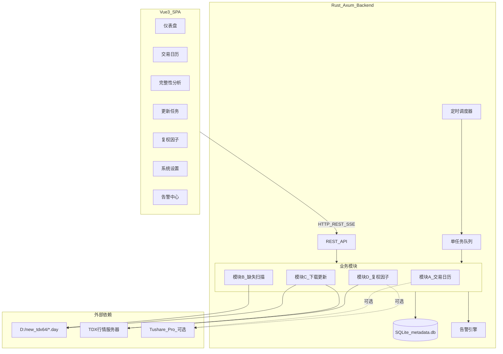
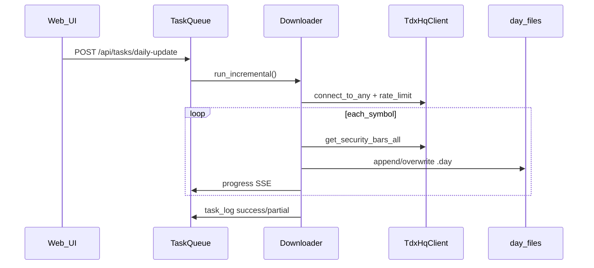
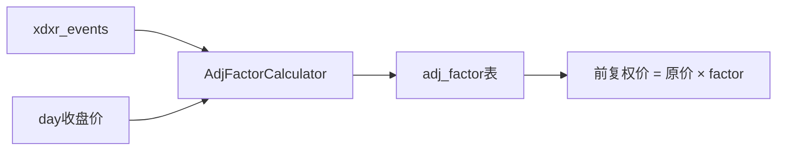
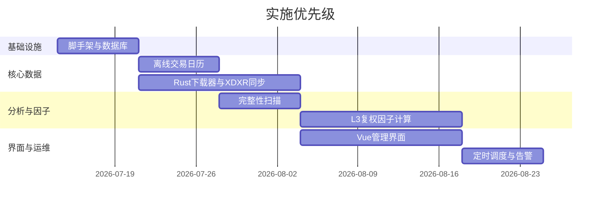

# 通达信本地行情数据维护系统 — 项目规划设计

## 1. 项目定位与约束

**目标**：维护 `D:\new_tdx64` 下全市场日线 `.day` 数据完整性，并持久化可查询的复权因子元数据，通过 Web 界面进行扫描、更新、告警与配置。

**已确认决策**（来自需求文档 + 你的选择）：

| 决策项 | 结论 |
|--------|------|
| 复权因子模式 | **L3 离线优先**（tdxrs XDXR 本地计算为主） |
| 前端技术 | **Vue 3 SPA** |
| 元数据库 | **SQLite**（`D:\tdx_maintain\data\metadata.db`） |
| 品种/周期 | 全市场 A 股 + 指数 + 板块，仅日线 |
| 部署 | Windows 单机，`127.0.0.1` 本地 Web 服务 |

**关键架构修正**（调研补充）：

- tdxrs 的 `Downloader` 批量下载器目前为 **Python 层实现**，Rust crate 侧提供 `TdxHqClient` / `AsyncTdxHqClient` + `DailyBarReader`，需在 Rust 后端**自行实现下载调度器**（参考 tdxrs Python Downloader 的多服务器轮转、翻页、限流、断点续传逻辑）。
- L3 离线模式下，**交易日历无法依赖 Tushare**，需增加离线日历源（见 3.1 节）。

---

## 2. 总体架构



**技术栈确定**：

| 层级 | 选型 | 理由 |
|------|------|------|
| 后端 | Rust + **axum** + tokio | 与 tdxrs 同栈；axum 生态现代、中间件完善 |
| 数据库 | **sqlx** + SQLite | 编译期 SQL 检查、async 友好 |
| 定时任务 | **tokio-cron-scheduler** | 需求文档推荐；支持 cron 表达式 |
| 配置 | **config** + TOML | 路径、Token、限流、降级阈值可热加载 |
| 前端 | **Vue 3 + Vite + Pinia + Vue Router** | 你已选定；适合管理后台 |
| UI 组件 | **Element Plus** 或 Naive UI | 表格/表单/进度条成熟，开发效率高 |
| 实时进度 | **SSE (Server-Sent Events)** | 下载/扫描任务进度推送，比轮询轻量 |

---

## 3. 仓库目录结构

```
D:\gp\local_tdx\
├── Cargo.toml                    # workspace root
├── README.md
├── config/
│   └── default.toml              # 默认配置模板
├── migrations/
│   └── 001_init.sql              # 需求文档 §6.1 六表 DDL
├── crates/
│   ├── tdx-maintain-core/        # 核心业务逻辑（无 HTTP 依赖）
│   │   ├── src/
│   │   │   ├── calendar/         # 模块 A
│   │   │   ├── scanner/          # 模块 B
│   │   │   ├── downloader/       # 模块 C（Rust 自实现）
│   │   │   ├── adj_factor/       # 模块 D（L3 本地计算 + 降级框架）
│   │   │   ├── task/             # 任务队列、日志
│   │   │   ├── alert/            # 告警规则
│   │   │   ├── db/               # Repository 层
│   │   │   └── config/           # 配置模型
│   │   └── Cargo.toml
│   └── tdx-maintain-server/      # axum HTTP 服务
│       ├── src/
│       │   ├── routes/           # REST API 路由
│       │   ├── sse/              # 任务进度 SSE
│       │   └── main.rs
│       └── Cargo.toml
├── frontend/                     # Vue 3 SPA
│   ├── src/
│   │   ├── views/                # 7 个页面（模块 E）
│   │   ├── api/                  # axios 封装
│   │   ├── stores/               # Pinia 状态
│   │   └── components/
│   └── package.json
├── scripts/
│   ├── dev.ps1                   # 一键启动 dev
│   └── install-service.ps1       # 可选：注册 Windows 服务
└── 通达信本地行情数据维护系统 — 需求调研报告（终版）.md
```

---

## 4. 分阶段实施路线

### Phase 0 — 工程脚手架（第 1 周）

- 初始化 Rust workspace + Vue 3 前端工程
- 添加依赖：`tdxrs`（path/git）、`axum`、`sqlx`、`tokio-cron-scheduler`、`serde`、`tracing`
- 执行 [`migrations/001_init.sql`](migrations/001_init.sql) 创建 6 张表（`trade_calendar`、`xdxr_events`、`adj_factor`、`factor_validation`、`sync_meta`、`task_log`）
- 实现配置加载：`tdx_data_dir`、`metadata_db_path`、`tushare_token`（可选）、限流参数
- 健康检查 API：`GET /api/health`

### Phase 1 — 模块 A 交易日历 + 模块 C 基础下载（第 2–3 周）

**模块 A（L3 离线日历策略）**：

由于你选择 L3 离线，交易日历采用 **双源降级**：

1. **主源（离线）**：从基准指数 `.day` 文件（如 `sh/lday/000001.day` 上证指数）提取日期序列作为交易日基准
2. **辅源（可选）**：若后续配置 Tushare Token，自动升级为 `trade_cal` 官方日历并覆盖/校验
3. **手动刷新**：Web 界面支持触发日历重建 + 节假日调休标注

核心接口（`tdx-maintain-core/src/calendar/`）：
- `build_calendar_from_index()` — 离线构建
- `sync_calendar_incremental()` — 增量更新
- `is_trading_day(date)` — 供调度器使用

**模块 C（Rust 下载器）**：

在 `downloader/` 中实现，参考 tdxrs Python Downloader 行为：



- `run_full()` — 全量覆盖
- `run_incremental()` — 基于本地最后日期增量追加
- `run_gap_fill(gaps)` — 结合模块 B 缺失清单精准补数
- `run_xdxr_sync()` — 同步除权除息事件到 `xdxr_events` 表
- 内置 `RateLimiter`：盘中 15rps / 盘前盘后 30rps / 休市 60rps
- 更新前 `.day` 文件备份到 `D:\tdx_maintain\backup\{date}\`

### Phase 2 — 模块 B 完整性扫描（第 4 周）

`scanner/` 模块：

- 遍历 `D:\new_tdx64` 下全部 `.day` 文件（`DailyBarReader` 高性能读取）
- 与 `trade_calendar` 比对，输出三类缺失：
  - 无本地文件
  - 时间序列缺口（日期区间列表）
  - 最新日期滞后（滞后天数）
- XDXR 事件缺口扫描：对比 `xdxr_events` 与 tdxrs 最新拉取结果
- 复权因子缺口扫描：检查 `adj_factor` 是否覆盖到最近交易日
- 扫描结果缓存到内存/临时表，支持 CSV 导出 API

### Phase 3 — 模块 D 复权因子 L3 核心（第 5–6 周）

**L3 为主路径**（你的选择），同时保留 L0–L2 可插拔框架：

| 组件 | 实现 |
|------|------|
| `AdjFactorCalculator` | 实现需求文档 D3 公式，基于 `xdxr_events` + `.day` 收盘价逐笔累乘 |
| `XdxrSyncService` | 调用 tdxrs `get_xdxr_info`，写入 `xdxr_events` |
| `TierProbe` | 探测 Tushare 可用性（Token 存在且调用成功 → 升级等级） |
| `TierStrategy` trait | L0/L1/L2/L3 策略实现，通过 `sync_meta.adj_factor_tier` 驱动 |
| `CrossValidator` | Tushare vs 本地比对，偏差 >1% 写入 `factor_validation` |

L3 计算流程：



- 只存因子值，不存复权后 K 线（需求文档 §6.2 设计原则）
- `data_source='local_xdxr'`，`confidence='normal'`
- 若后续配置 Token 且探测通过，自动尝试 L0 拉取并交叉校验

### Phase 4 — 模块 E Web 界面（第 5–7 周，与 Phase 3 并行）

7 个页面对应需求文档 §4 模块 E：

| 页面 | 路由 | 核心 API |
|------|------|----------|
| 仪表盘 | `/` | `GET /api/dashboard` — 完整率、降级等级、最近任务 |
| 交易日历 | `/calendar` | `GET/POST /api/calendar` |
| 完整性分析 | `/scan` | `POST /api/scan/{type}`, `GET /api/scan/results` |
| 更新任务 | `/tasks` | `POST /api/tasks`, `GET /api/tasks`, SSE `/api/tasks/{id}/progress` |
| 复权因子 | `/factors` | `GET /api/factors`, `POST /api/factors/sync` |
| 系统设置 | `/settings` | `GET/PUT /api/settings` |
| 告警中心 | `/alerts` | `GET /api/alerts`, `PATCH /api/alerts/{id}` |

前端关键交互：
- 任务进度条（SSE 实时更新）
- 扫描结果大表格 + 筛选（市场/品种类型）+ 导出
- 降级等级醒目标识（L3 模式常驻提示条）
- 设置页敏感字段（Tushare Token）脱敏显示

### Phase 5 — 定时调度 + 告警 + 收尾（第 7–8 周）

**默认定时策略**（采纳需求文档 §8 问题 3 建议）：

| 任务 | Cron | 条件 |
|------|------|------|
| 日线增量更新 | `30 15 * * 1-5` | 当日为交易日 |
| XDXR 同步 | `0 16 * * 1-5` | 同上 |
| 复权因子更新 | `30 16 * * 1-5` | 同上 |
| 交易日历校验 | `0 2 1 * *` | 每月 1 日凌晨 |
| 完整性扫描 | `0 6 * * 6` | 每周六 |

**告警规则**（页面内，无邮件/IM）：

- 日线完整率 < 阈值（默认 95%）
- 更新任务失败 / partial
- 复权因子 `conflict` 超阈值
- 降级等级变化（L3 → 更高或反向）

**交叉校验处理**（采纳需求文档 §8 问题 4 默认方案）：标记 `conflict` 并告警，**不自动屏蔽查询**，由用户在告警中心确认。

---

## 5. 核心 API 设计概要

```
/api
├── /health
├── /dashboard
├── /calendar
│   ├── GET     — 查询日历
│   └── POST    — 刷新日历
├── /scan
│   ├── POST /daily-bars      — 触发日线缺失扫描
│   ├── POST /xdxr            — 触发 XDXR 缺口扫描
│   ├── POST /adj-factors     — 触发因子完整性扫描
│   └── GET  /results/{id}    — 获取扫描结果 + 导出
├── /tasks
│   ├── GET                   — 任务历史
│   ├── POST /daily-full      — 全量日线
│   ├── POST /daily-increment — 增量日线
│   ├── POST /daily-gap-fill  — 精准补数
│   ├── POST /xdxr-sync       — XDXR 同步
│   ├── POST /adj-factor-sync — 复权因子更新
│   └── GET  /{id}/progress   — SSE 进度流
├── /factors
│   ├── GET  ?market&symbol&date — 查询因子
│   └── GET  /validation         — 交叉校验结果
├── /settings
│   ├── GET / PUT
├── /alerts
│   ├── GET
│   └── PATCH /{id}/acknowledge
└── /schedule
    ├── GET  — 查看定时配置
    └── PUT  — 修改 cron 表达式
```

---

## 6. 数据库与持久化

直接采用需求文档 §6.1 DDL，存放于 [`migrations/001_init.sql`](migrations/001_init.sql)。

**`sync_meta` 预置键**：

| key | 用途 |
|-----|------|
| `adj_factor_tier` | 当前降级等级 L0–L3 |
| `last_probe_at` | 上次 Tushare 探测时间 |
| `last_daily_update` | 最近日线更新时间 |
| `last_adj_factor_update` | 最近因子更新时间 |
| `calendar_source` | `index_derived` / `tushare` |

---

## 7. 关键技术风险与应对

| 风险 | 应对 |
|------|------|
| tdxrs Downloader 仅 Python 层 | Rust 自实现下载器，复用 `AsyncTdxHqClient` + `DailyBarReader` 写 `.day` |
| L3 离线日历精度 | 指数 `.day` 为主 + 每月校验 + 支持手动修正；预留 Tushare 升级路径 |
| 全市场扫描性能 | `DailyBarReader` 并行扫描（`rayon`），结果分批写入 |
| 单任务队列阻塞 | 扫描与下载互斥；长时间任务支持取消 |
| `.day` 覆盖损坏 | 更新前自动备份到独立目录，失败可回滚 |
| Tushare 后续接入 | `TierStrategy` trait + `sync_meta` 驱动，L3 代码路径不变 |

---

## 8. 非功能需求落地

| 需求 | 实现 |
|------|------|
| 30 分钟内完成日更新 | 多服务器轮转 + 限流 + 并行 Reader 扫描 |
| 可观测性 | `task_log` 表 + `tracing` 结构化日志 + 前端任务详情 |
| 数据安全 | 备份机制 + 事务写入 SQLite |
| 单机部署 | 编译为单个 `tdx-maintain-server.exe`，前端 `dist` 由 axum 静态托管 |

---

## 9. 开发优先级（基于 L3 离线选择）



**L3 模式下可延后但保留接口的部分**：Tushare `trade_cal` / `adj_factor` 在线拉取、L0–L2 限流分批策略、交叉校验 UI 详情页。

---

## 10. 验收标准

1. 能从 Web 界面触发全市场日线增量更新，进度实时可见，结果写入 `task_log`
2. 完整性扫描能输出缺失/滞后清单并支持导出
3. L3 模式下复权因子基于 XDXR 本地计算并持久化到 `adj_factor`，可按 symbol+date 查询
4. 交易日历离线构建可用，调度器能正确判断交易日
5. 告警中心能展示任务失败、数据缺失、降级等级变化
6. 系统设置可配置 `D:\new_tdx64` 路径、TDX 服务器、限流参数
7. 全量/增量更新前自动备份 `.day` 文件
